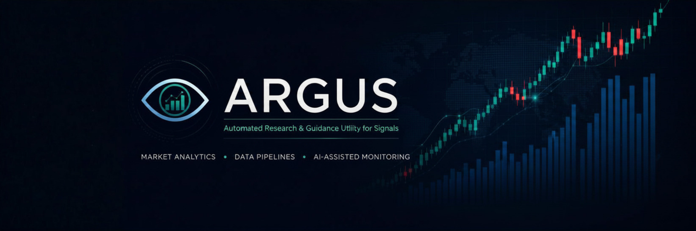

# ARGUS

<div align="center">
  
</div>

---

ARGUS is a Python-based market analytics project evolving from a small FX converter into a broader data-oriented platform for exchange rates, market data, analytics, dashboards, and future AI-assisted monitoring workflows.

> [!NOTE]
> This project started as **FX Converter Lab** and is being renamed to **ARGUS** as the scope grows beyond simple currency conversion.

ARGUS is currently focused on building a clean local foundation:

- currency conversion using live exchange-rate data
- calculator and conversion logic
- input validation and error handling
- Tkinter GUI prototype
- legacy CLI/debug interface
- first pandas/matplotlib-based analytics prototype
- tests and documentation

> [!IMPORTANT]
> ARGUS is not a finished trading tool or financial advisor.  
> It is a portfolio and learning project for building reliable data, analytics, visualization and future automation workflows.

---

## License

This project is licensed under the [Apache License 2.0](LICENSE).  

## Project Direction

ARGUS is designed to grow step by step from a local Python application into a market analytics and monitoring system.

The long-term direction includes:

- market data ingestion
- historical FX and market data analysis
- reusable analytics and metric layers
- dashboards and visualizations
- local and cloud-based storage
- data quality checks
- reporting workflows
- future AI-assisted research and agentic monitoring

> [!TIP]
> The goal is to keep each development step usable and testable instead of building a large system all at once.

---

## Roadmap

The full project roadmap is maintained separately in [`docs/roadmap.md`](docs/roadmap.md).

Each roadmap phase is treated as a separate development sprint. The roadmap describes how ARGUS is planned to grow from a local Python application into a broader market analytics, data engineering and future AI-assisted monitoring system.

> [!TIP]
> The README gives a compact project overview.  
> Detailed planning, sprint scope and long-term architecture notes live in the documentation files.

---

## Current Features

- Calculator
- Currency conversion using live exchange rates
- Input validation and error handling
- Tkinter GUI prototype
- Legacy CLI/debug interface
- Basic pandas-based trend metrics
- Matplotlib-based trend visualization
- Mock time-series data for early analytics development
- Basic test suite

> [!CAUTION]
> Historical market data support is still limited.  
> The current live exchange-rate client is useful for simple conversion, but future analytics work will require additional data sources such as Frankfurter or yfinance.

---

## Project Structure

```text
docs/
src/
  argus/
    analytics/
      charts/
      metrics/
    clients/
    domain/
    gui/
    services/
    config.py
    main.py
  legacy/
    cli/
tests/
pyproject.toml
README.md
```

---

## Current Tech Stack

### Language

- Python 3.11+

### Core libraries

- requests
- python-dotenv
- pandas
- NumPy
- matplotlib
- Tkinter
- pytest

### Current data source

- ExchangeRate API for live currency conversion

---

## Planned / Future Tech Stack

ARGUS is expected to grow into a broader data and analytics system.

Planned or likely future technologies include:

### Data sources

- Frankfurter API for historical FX data
- yfinance for broader market data
- possible additional market-data APIs later

### Data processing

- pandas
- NumPy
- possibly Polars later for larger datasets

### Storage

- PostgreSQL
- DuckDB
- Parquet
- optional cloud storage

### Visualization and UI

- matplotlib
- Plotly
- NiceGUI

### DevOps and deployment

- GitHub Actions
- Docker
- Docker Compose
- cloud deployment later

### Cloud and data engineering

- Azure, GCP or AWS depending on project direction
- scheduled ingestion
- data quality checks
- reporting pipelines

### AI and agentic workflows

- LLM-assisted summaries
- RAG over stored reports or notes
- agentic data checks
- anomaly monitoring
- human-in-the-loop signal review

> [!CAUTION]
> AI and agentic features are future-stage ideas.  
> They should only be added after the data, storage, service and reporting layers are stable.

---

## Requirements

Before running ARGUS locally, make sure you have:

- Python 3.11 or newer
- Git
- pip
- an ExchangeRate API key for live currency conversion

Recommended for development:

- VS Code
- a virtual environment
- pytest

> [!NOTE]
> Runtime dependencies are managed through `pyproject.toml`.

---

## Setup

Clone the repository:

```bash
git clone https://github.com/BytecodeBrewer/argus.git
cd argus
```

Create a virtual environment:

```bash
python -m venv .venv
```

Activate the virtual environment.

On Windows PowerShell:

```powershell
.venv\Scripts\Activate.ps1
```

On macOS/Linux:

```bash
source .venv/bin/activate
```

Install the project in editable mode:

```bash
pip install -e .
```

For development and tests, install the development dependencies:

```bash
pip install -e ".[dev]"
```

> [!TIP]
> Editable install keeps the project linked to your local source files.
> This means code changes are picked up without reinstalling the project after every edit.

---

## API Key Setup

ARGUS currently uses the ExchangeRate API for live currency conversion.

### 1. Create an API key

Create a free account at ExchangeRate API and generate your personal API key.

### 2. Create a `.env` file

Create a file named `.env` in the project root:

```text
.env
```

Add your API key:

```env
api_key=your_api_key_here
```

### 3. Keep secrets private

The `.env` file must stay local and should never be committed.

> [!WARNING]
> Never commit API keys, tokens or secrets to the repository.
> Make sure `.env` is listed in `.gitignore`.

---

## Running ARGUS

Start the current Tkinter GUI:

```bash
python -m argus.main
```

This starts the local ARGUS prototype with calculator, currency conversion and basic analytics views.

### Legacy CLI / Debug Interface

The legacy CLI is still available for quick local checks and debugging:

```bash
python src/legacy/debug_main.py
```

> [!NOTE]
> The Tkinter GUI is the current main local interface.
> The CLI is kept as a legacy/debug interface and is not the long-term product interface.

---

## Running Tests

Run the test suite:

```bash
pytest
```

> [!TIP]
> Run tests after changing clients, services, validation logic or analytics functions.

---

## Documentation

More detailed project documentation lives in [`docs/`](docs/).

Current documentation:

- [`docs/roadmap.md`](docs/roadmap.md) — sprint-based project roadmap
- [`docs/gui.md`](docs/gui.md) — notes about the current Tkinter GUI prototype
- metric and UI research notes for future analytics and interface decisions

---

## Status

ARGUS has completed its first foundation phase.

The project now has a runnable local Python application, a Tkinter GUI prototype, basic analytics, tests, documentation, CI checks and open-source readiness files.

Current focus:

- start Sprint 2 — Market Analytics & Data Source Expansion
- improve historical exchange-rate data support
- add stronger market metrics
- expand pandas-based analytics workflows
- improve dashboard usefulness without adding unnecessary chart noise
- document metric definitions, assumptions and data-source behavior
